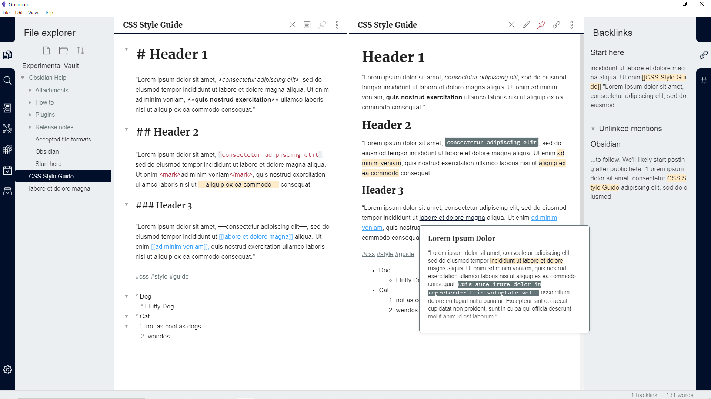
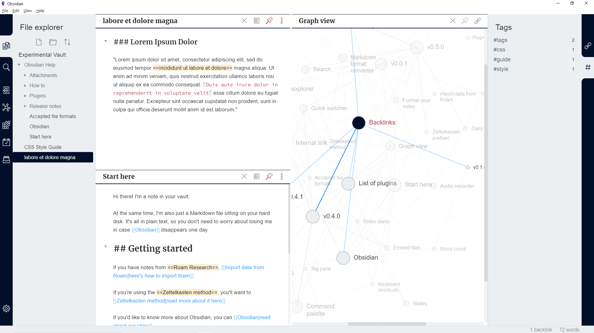

# Gastown for [Obsidian.md](https://obsidian.md/)
> A light theme for [Obsidian](https://obsidian.md/), compatible to Obsidian V0.5.0

## Install

1. Download the obsidian.css file.

2. In Obsidian click Settings -> Plugins and turn on "Custom CSS".

3. Put the "obsidian.css" in your vault root folder.

4. Restart Obsidian.

Note: To achieve the best visual effect, please install the free fonts [Merriweather](https://fonts.google.com/specimen/Merriweather) and [Open Sans](https://fonts.google.com/specimen/Open+Sans)

## Creator

This theme is created and maintained by Nick. [Twitter](https://twitter.com/dogwaddle), if there is a design change you'd like to see to this theme, let me know and I will consider it. Always open to suggestions.

